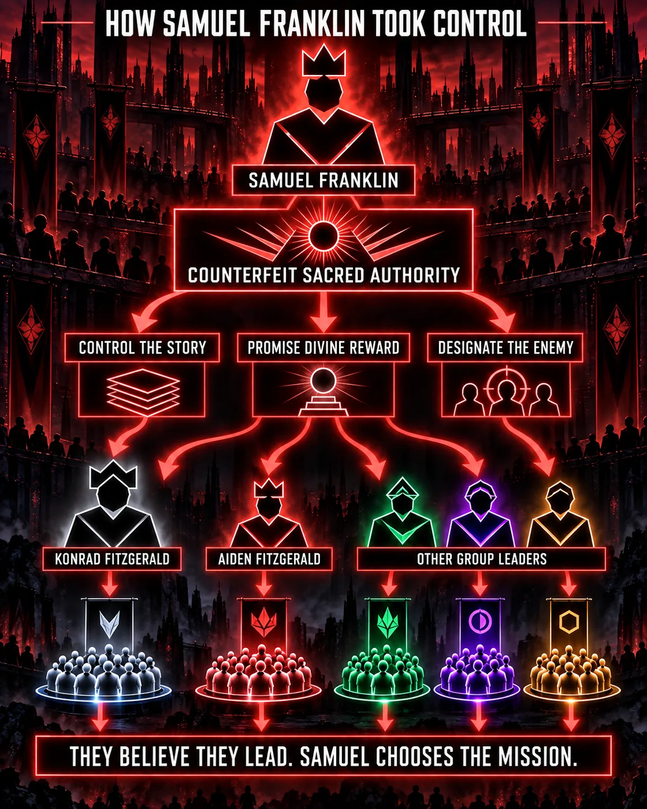
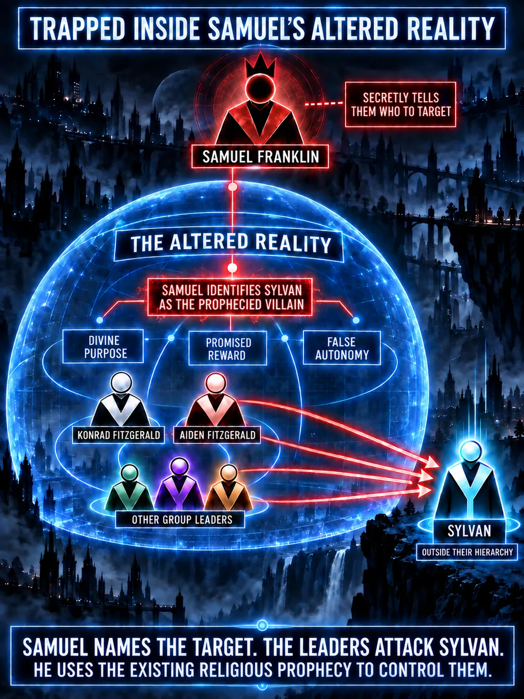

# Existing Prophecy Endgame Expansion

## Author correction

The prophecy already exists inside an original religion of the reconstructed civilization. Konrad's group did not create it. Samuel did not write it.

Samuel's manipulation begins at application. Inside the altered reality, he controls enough records, access, intermediaries, timing, and apparent confirmation to tell Konrad, Aiden, and the other leaders that Sylvan is the enemy described by the prophecy. They remain responsible for accepting that identification and attacking him.

This distinction supersedes any wording that implies Samuel creates, authors, or owns the prophecy. He counterfeits interpretive authority and names the target.

## Endgame function

The same event now carries three story layers:

1. Konrad, Aiden, and allied leaders believe they are defending a sacred mission from its foretold enemy.
2. Samuel uses that sincere belief to direct an attack on Sylvan while preserving the leaders' false sense of autonomy.
3. Sylvan's refusal and the Resistance evidence reveal that Samuel used the same altered-reality method to capture the leaders after the Great War and to hide what he did to their groups.

The reveal does not prove or disprove the religion or prophecy. It proves that Samuel selected the target, controlled the apparent confirmation, and revised the interpretation when events did not follow his plan.

## Approved explanatory visuals

- **How Samuel Franklin Took Control:** a red control diagram showing Samuel's captured interpretive channel, promised reward, designated enemy, and control of Konrad, Aiden, other leaders, and their groups.
- **Trapped Inside Samuel's Altered Reality:** a blue-and-red diagram showing Samuel outside the leaders' perceived hierarchy, identifying Sylvan as the prophecied villain and using the existing religious prophecy to control their attack.

These diagrams are author-approved explanations of the endgame mechanism. Their icons, architecture, exact arrows, and interface styling are interpretive rather than literal story canon.

## Unresolved questions

- What does the existing prophecy actually say, and what part of it can plausibly be misapplied to Sylvan?
- Who preserves and legitimately interprets it outside Samuel's altered reality?
- What staged evidence makes Samuel's identification of Sylvan persuasive?
- What does each leader independently choose after receiving the identification?
- What contradiction first lets a believer separate the prophecy from Samuel's target assignment?
- What evidence proves Samuel named the target without requiring the story to rule on the prophecy's metaphysical truth?
- How does the religion continue after Samuel's fraud is exposed?

## Vault impact

- [[02 Story/Systems/Original Religions and Counterfeit Sacred Authority]]
- [[02 Story/Systems/Story Functionality and Narrative Containment]]
- [[02 Story/Characters/Samuel Franklin]]
- [[02 Story/Characters/Konrad Fitzgerald]]
- [[02 Story/Characters/Aiden Fitzgerald]]
- [[07 Coordination/Story Completion Workflow/Endgame Workshop/README]]
- Endgame Workshop modules EG-09 through EG-12
