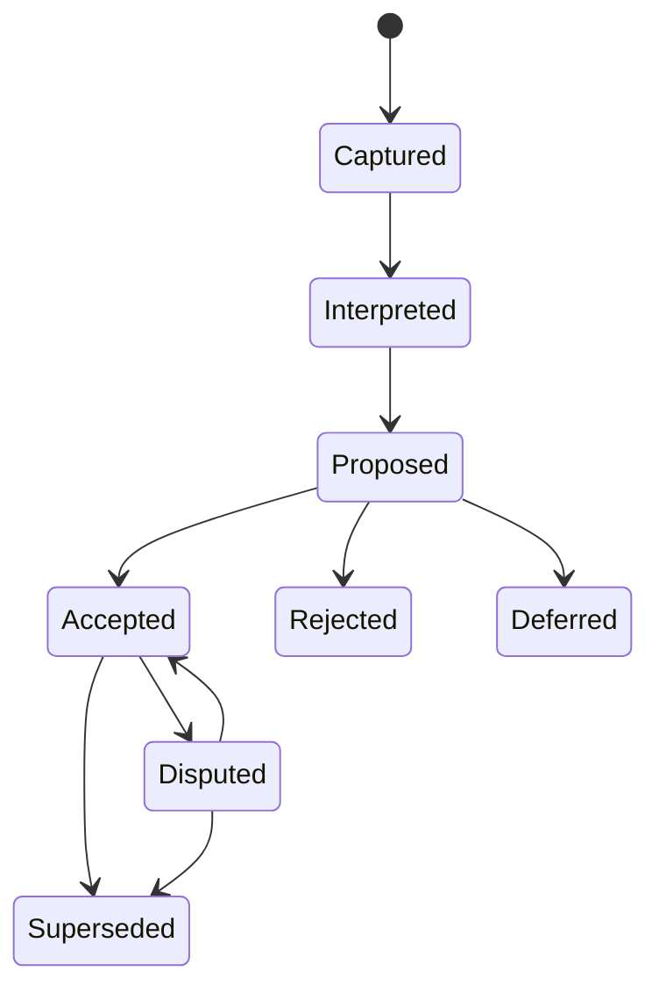

# Story Runtime and Data Model

## Established architectural direction

Build an **event-sourced Markdown system**, not a database, JSON-backed authoring system, or large framework.

- Markdown remains the human-readable durable source.
- Stable frontmatter IDs make records addressable.
- Accepted decision events are append-only; corrections supersede rather than erase history.
- Deterministic scripts parse and validate Markdown and may build interfaces directly from it.
- Project Explorer provides browsable views over the Markdown vault rather than exposing a separate JSON data model.
- Websites consume Markdown-derived output instead of maintaining separate copies of story truth.
- Git supplies version history and collaboration until a different persistence layer is justified.

This preserves Obsidian usability, direct browsing, and portability while giving the engines machine-checkable state through frontmatter, stable IDs, links, headings, and validation rules.

Generated data held in memory or emitted as disposable build output is permitted only when technically necessary. It must be fully rebuildable from Markdown, invisible to normal authoring, and incapable of becoming story authority or a parallel database.

## Three information layers

| Layer | Meaning | May establish story truth? |
|---|---|---|
| Source | what the author, research, archive, or draft actually said | author source can, after confirmation; research cannot |
| Understanding | the system's normalized interpretation | no |
| Story use | a proposed or accepted implication for the project | only after author acceptance |

## Authority lifecycle



Only `accepted` events update canonical projections. `working` material may support drafting when explicitly permitted, but must remain visible in the scene contract.

## Core record types

| Record | Stable ID example | Required role |
|---|---|---|
| Source fragment | `SRC-20260907-001` | raw quotation, transcript, file, or research observation |
| Decision | `DEC-0042` | question, accepted answer, alternatives, provenance, status |
| Story entity | `CHAR-SYLVAN`, `SYS-LUMINAI` | character, place, group, system, artifact, institution |
| Event | `EVT-GW-014` | chronological occurrence and causal state change |
| Revelation | `REV-B1-009` | when/how the reader learns an event or fact |
| Knowledge state | `KN-SYLVAN-018` | what a character believes, evidence, confidence, and time |
| Promise/payoff | `PP-0021` | setup, reader expectation, planned or completed payoff |
| Task/gap | `GAP-0034` | unresolved need, impact, dependencies, next gate |
| Sequence | `SEQ-B1-006` | entering state, resulting state, constituent scenes |
| Scene contract | `SCN-B1-023` | bounded approved inputs and required dramatic change |
| Draft artifact | `DRF-B1-023-A` | prose version, source contract, checks, approval state |
| Voice Key profile | `VK-SEEDS-001` | evidence-linked authorial decision traits, scope, confidence, project modifiers, and feedback |

## Minimum decision event

```yaml
id: DEC-0042
status: accepted
question: What can Sylvan lose after decisive control?
raw_sources: [SRC-20260907-014]
interpretation: "..."
accepted_answer: "..."
accepted_by: author
accepted_at: 2026-09-07
supersedes: []
affects: [CHAR-SYLVAN, SEQ-B1-006, GAP-0034]
open_edges: []
```

## Minimum scene contract

```yaml
id: SCN-B1-023
status: approved-for-draft
pov: CHAR-SYLVAN
time: EVT-ENDGAME-031
location: PLACE-OUTCOME-HALL
objective: "..."
obstacle: "..."
turn: "..."
choice: "..."
entering_state: [STATE-...]
resulting_state: [STATE-...]
allowed_facts: [DEC-..., EVT-..., KN-...]
working_assumptions: []
forbidden_inventions: ["..."]
reader_revelations: [REV-...]
checks: [continuity, knowledge, causality, voice, narrative-residue]
```

## Graphs the runtime must compute

- decision → affected entities, events, sequences, scenes, prose, and public views;
- chronology → event order independent of book order;
- revelation → reader knowledge by chapter;
- character knowledge → belief, evidence, confidence, and misinformation over time;
- setup → promise → payoff;
- institution/system → permissions, limits, safeguards, failures, and accountability;
- scene outputs → next scene inputs;
- source and author-choice evidence → general Voice Key traits → project modifiers → passage decisions;
- supersession → stale artifacts requiring review.

## Deterministic responsibilities

Code, not a language model, should own:

- unique IDs and schema validation;
- status transition validity;
- broken links and missing targets;
- reverse dependency and blast-radius reports;
- chronology and impossible-knowledge checks where data is explicit;
- stale projection detection;
- readiness/completion calculations;
- site generation, exports, and round-trip persistence tests;
- exact pickup state.
- Voice Key schema validity, evidence links, allowed scope, and recent modifier-history bookkeeping.

Generative models should own:

- interpreting natural-language intake;
- identifying likely gaps and contradictions;
- proposing alternatives and consequences;
- crafting questions;
- building scene candidates and prose;
- explaining test failures in story terms.

## Projection model

Canonical Markdown and accepted events produce disposable views:

- current story bible;
- unresolved decision queue;
- author pickup summary;
- Workshop context packet;
- Composition context packet;
- Project Explorer data;
- spoiler-controlled reader-site data;
- manuscript order and export.

A projection can be deleted and rebuilt. If it cannot be rebuilt, it has accidentally become a second source of truth.

## Conflict behavior

When two accepted records conflict, the runtime opens a dispute and freezes only affected outputs. It must not choose the newest file, most polished prose, or model-preferred interpretation automatically. Unaffected work can continue.
