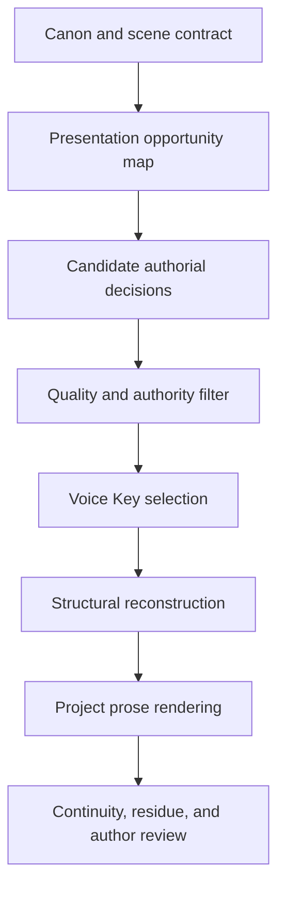

# Voice Key

## Purpose

Voice Key personalizes authorship decisions rather than merely imitating speech. It learns what a user notices, what they treat as evidence, how they construct causality, how they judge outcomes, what they expand or omit, where they tolerate ambiguity, and which surprising alternatives they prefer.

The Composition Engine uses this fingerprint to choose how approved story information is presented. A professional prose model still supplies syntax, clarity, craft, and project-appropriate language.

## Product distinction

| Surface voice system | Voice Key |
|---|---|
| Copies vocabulary and cadence | Learns presentation decisions |
| Tries to sound like a transcript | Produces polished writing directed by the user's judgment |
| Operates mainly on sentences | Operates on information order, attention, causality, evidence, ambiguity, and closure |
| Adds stylistic variation | Selects among meaningful narrative alternatives |
| Risks caricaturing the speaker | Keeps traits evidence-linked, confidence-rated, and project-specific |

Surface voice remains an optional low-weight signal after the important narrative choices have been made.

## Three profile levels

### General fingerprint

Stable tendencies supported across unrelated conversations and creative exercises. A general fingerprint may describe evidence preference, causal reasoning, attention allocation, correction behavior, emotional distance, and closure preference. It must not contain private biographical detail merely because that detail appeared in a source transcript.

### Project fingerprint

The general tendencies are translated into useful pressures for one project. A systems-attention tendency may become infrastructure and archive evidence in *Seeds*, domestic process in a memoir, or product behavior in an essay. Project profiles prevent every work from receiving the same presentation pattern.

### Passage profile

Each passage receives only the pressures that serve its contract. The engine must not apply every fingerprint trait everywhere. Passage purpose, recent pattern history, POV knowledge, and reader state govern selection.

## Fingerprint dimensions

| Dimension | Learns | Controls |
|---|---|---|
| Attention | what earns notice and space | focal detail and information density |
| Causality | what makes consequences believable | event and revelation order |
| Evidence | what makes a conclusion convincing | declaration versus demonstration |
| Judgment | how success and failure are measured | competing interpretations |
| Ambiguity | which uncertainty is productive | explanation and openness |
| Surprise | which non-default choice still feels earned | twist and turn selection |
| Emotional distance | how meaning becomes visible | statement, behavior, or accumulation |
| Compression | what an audience may infer | omission and expansion |
| Correction | how a false premise is challenged | rejection, concession, or reframing |
| Closure | which obligations must be completed | payoff and open perimeter |

Every stored trait requires supporting source or choice references, confidence, scope, contradiction history, and author feedback status.

## Initial provisional fingerprint

The first eight interviews support these candidates:

| ID | Candidate tendency | Confidence | Default operator |
|---|---|---:|---|
| VK-01 | operational evidence before verdict | 0.93 | expose the mechanism before summarizing its meaning |
| VK-02 | constraints generate direction | 0.92 | let a real limitation redirect action and preserve the cost |
| VK-03 | the real goal determines success | 0.90 | give actors different measurements of the same outcome |
| VK-04 | designed system versus lived reality | 0.89 | contrast the official model with an experienced exception |
| VK-05 | gradual behavioral proof | 0.82 | distribute evidence before naming the conclusion |
| VK-06 | earned closure with an open perimeter | 0.80 | close the primary promise and preserve limited secondary possibility |
| VK-07 | quality over the pleasure of production | 0.86 | remove invention that does not improve the audience's result |
| VK-08 | technology should increase human capability | 0.84 | judge technology through agency, learning, adaptation, and accountability |
| VK-09 | qualified criticism | 0.77 | ground judgment in experience, complexity, and evidence |
| VK-10 | asymmetrical information density | 0.70 | choose one high-resolution causal element and compress adjacent material |

These confidence values are provisional design metadata, not scientifically calibrated measurements. They exist to support revision and testing rather than claim psychological precision.

## Seeds project profile

### Project pressures

- Reveal Samuel through operational evidence before explanatory accusation when the scene allows it.
- Use containment rules, permissions, resources, jurisdiction, and access limits as plot-generating constraints.
- Let Samuel, Konrad, Sylvan, Orzai, and the real leaders measure the same outcome differently.
- Contrast official containment structure with the false versions participants believe they inhabit.
- Demonstrate Sylvan–Luminai integration through repeated behavior and increasingly compressed coordination.
- Prefer evidence that changes the meaning of an earlier scene over exposition that merely adds information.
- Close the immediate deception while preserving the larger consequences of Luminai initialization.
- Communicate major realization through altered behavior as well as direct statement.

### Passage modifiers

- `MECHANISM_FIRST`: expose operation before interpretation.
- `CONSTRAINT_PIVOT`: let an established limit redirect the passage.
- `COMPETING_SCORE`: show actors evaluating the same event under different goals.
- `LIVED_EXCEPTION`: reveal the gap between formal design and experienced reality.
- `BEHAVIORAL_ACCUMULATION`: distribute proof across repeated actions.
- `DELAYED_RECOGNITION`: separate evidence arrival from a character's acceptance.
- `WRONG_QUESTION`: reveal that the apparent question did not govern the result.
- `OPEN_PERIMETER`: resolve the central promise while opening a secondary implication.
- `ASYMMETRIC_DETAIL`: render one causal element sharply and compress the rest.
- `QUIET_CONSEQUENCE`: express emotional effect through changed behavior.

### Modifier controls

- Apply zero to three modifiers to a normal passage.
- Do not repeat the same dominant modifier in consecutive passages without deliberate escalation.
- Do not add machinery that produces no consequence.
- Do not preserve ambiguity around a promise the work owes the audience.
- Do not confuse withheld information with meaningful uncertainty.
- Do not turn every scene into a system demonstration.
- Do not convert every event into an explicit thematic statement.

## Composition integration



### Canon lock

Extract immutable facts, required developments, forbidden changes, unresolved decisions, POV knowledge, and revelation ceilings. Voice Key cannot override this lock.

### Opportunity map

Mark places where more than one high-quality presentation remains possible:

- scene entry;
- focal detail;
- order of evidence;
- moment of recognition;
- explanation versus implication;
- cause versus consequence first;
- emotional distance;
- degree of closure;
- location and size of surprise.

### Candidate decisions

Generate alternate presentation strategies rather than paraphrases. A candidate may reorder approved information, select a different focal fact, delay recognition, compress an explanation, or allow a constraint to redirect the action.

### Quality and authority filter

Reject candidates that violate canon, settle an open author gate, weaken causality, repeat a recent device, invent false mystery, reduce clarity without payoff, or imitate human error.

### Fingerprint selection

Rank the survivors against passage function, project fingerprint, general fingerprint, recent modifier history, and expected payoff. Use bounded selection among the strongest choices so the engine does not always select the statistically most ordinary route.

### Structural reconstruction

Rebuild the passage around the selected information decisions before surface prose editing begins.

## Meaningful unpredictability

Voice Key creates earned non-default selection rather than random linguistic disorder. A scene receives a bounded surprise budget that can be spent by:

- showing consequence before cause;
- allowing a minor operational detail to invalidate a major claim;
- letting the apparent loser succeed under the real evaluation criterion;
- turning a workaround into evidence of the original deception;
- separating who sees the truth from who can accept it;
- resolving the visible conflict while opening a deeper implication;
- trusting behavior to prove what an AI draft would explain.

Every surprise must arise from accepted canon, an established constraint, a character's mistaken model, or a planted setup. Higher statistical perplexity is not itself a success measure.

## Proposed Markdown record

```yaml
id: VK-SEEDS-001
type: voice-key
status: proposed
scope: project
project: seeds-of-the-throne
traits:
  - id: VK-01
    label: operational evidence before verdict
    confidence: 0.93
    evidence: [SRC-...]
    contradictions: []
    author_feedback: provisional
modifier_weights:
  MECHANISM_FIRST: high
  CONSTRAINT_PIVOT: high
  COMPETING_SCORE: high
recent_modifier_history: []
forbidden_uses:
  - change canon
  - invent personal experience
  - imitate errors
  - target detector scores
```

The Markdown record is authoritative. A disposable runtime index may cache weights and recent use but must be rebuildable.

## Interview and calibration

Natural conversation provides raw reasoning evidence. Decision tasks provide stronger calibration:

- choose between alternative openings and explain why;
- rank scene details by importance;
- identify a falsely dramatic line;
- cut material without losing the point;
- decide what the audience can infer;
- select the most believable consequence of a constraint;
- replace a predictable turn with an earned alternative;
- choose which questions an ending must close;
- decide what may remain open;
- compare actual project passages and explain the preference.

A correction updates the relevant trait and evidence. It does not silently rewrite the entire general fingerprint.

## Evaluation

Use a blind three-way test:

1. strong project-aware AI baseline;
2. surface speech-profile version;
3. Voice Key authorial-selection version.

Score:

- author preference;
- project specificity;
- causal credibility;
- quality of presentation choices;
- earned surprise;
- canon violations;
- over-explanation;
- repeated device use;
- author corrections required.

Voice Key succeeds only when it improves writing quality and project identity. Sounding like the user's raw dictation is not the success condition.

## Provenance and privacy

- Preserve raw source separately from extracted traits.
- Do not expose private transcript content inside project profiles when an abstract trait is sufficient.
- Keep evidence links inspectable to the author.
- Label inference and confidence.
- Allow trait rejection, correction, scope restriction, and deletion.
- Do not infer protected or sensitive personal attributes for writing control.
- Never promise that output will evade AI detectors.

## First test

Use the approved Book One outcome-presentation vertical slice. Lock the exact scene contract before generating variants. Compare presentation decisions rather than only wording, and reveal the generation method only after author evaluation.

## Open product gates

1. How many decision exercises are required before the initial fingerprint becomes useful?
2. Should the user see individual traits or only their effects and supporting examples?
3. How should general and project fingerprints resolve a conflict?
4. How quickly should unused preferences decay?
5. Should bounded selection be deterministic for reproducible manuscript builds or seeded per experiment?
6. How should the system learn from a user combining parts of several candidates?

