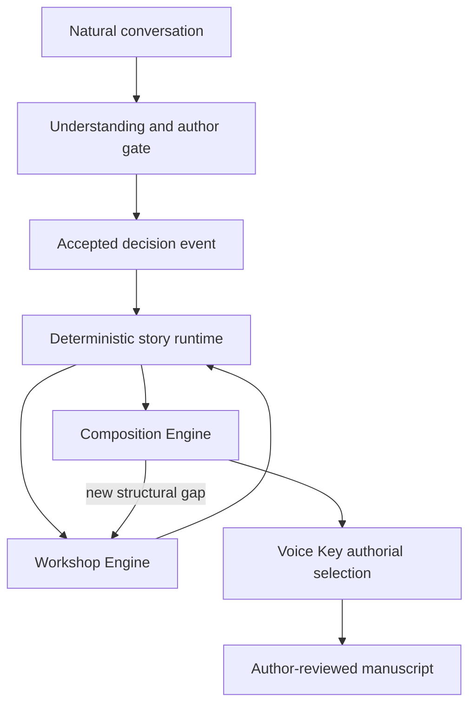

# Conversational Authoring System

## Product promise

You tell the system the story in ordinary language. It helps you discover what is missing, records only what you approve, handles the craft and continuity work underneath, and carries the project toward finished prose without requiring you to become a professional novelist first.

The governing success measure is **finished, faithful, author-approved story per minute of author attention**.

## System map

## Design documents

- [[01 - Product and Author Experience]] — user, promise, conversation modes, session experience, boundaries, and success measures.
- [[02 - Story Runtime and Data Model]] — durable records, authority states, dependencies, projections, validation, and persistence.
- [[03 - Workshop and Composition Engines]] — responsibilities, contracts, passes, handoffs, and failure behavior.
- [[04 - Audits, Vertical Slice and Roadmap]] — current-state assessment, reuse decisions, reconciliation, first proof, phases, and tests.
- [[05 - Prose Capability Matrix and Usage Routing]] — selective skill adoption, economical model routing, escalation triggers, revision limits, and evaluation.
- [[06 - Voice Key]] — transcript- and choice-derived authorial decision fingerprint, project modifiers, bounded narrative selection, provenance, and evaluation.

## Established direction versus proposed design

Established:

- initial user: story-rich, craft-light fiction creator;
- conversational intake and one author-gate question at a time;
- Workshop Engine and Composition Engine;
- finished prose and manuscript export are in scope;
- source, interpretation, proposal, and accepted story state remain distinct;
- only author-accepted choices propagate;
- Project Explorer demonstrates the system; Docs presents the story;
- open, durable project data and no controls that pretend to save.
- Markdown is the durable and directly browsable system; Project Explorer is its primary visual interface.
- Voice Key personalizes how information is selected and presented rather than primarily copying the user's spoken phrasing; surface voice is secondary.

Proposed:

- event-sourced Markdown records with deterministic Markdown indexing;
- stable entity and decision IDs;
- the question-priority model;
- the engine boundaries and pass sequence;
- the initial vertical slice and staged implementation plan.

## Design principles

1. Conversation is the interface; story state is the product.
2. The author supplies intention and judgment, not clerical maintenance.
3. Deterministic code reads and validates Markdown bookkeeping; generative models own interpretation and creative candidates.
4. No accepted decision disappears into chat history.
5. No generated prose silently becomes canon.
6. The system may recommend strongly, but consequential invention remains visible and reversible.
7. Every session can stop safely and resume exactly.
8. Complexity is internalized. The author sees the next meaningful choice, not a wall of workflow states.
9. Seeds is the proving ground before the system is generalized.
10. The author is represented most meaningfully through consequential selection, not through manufactured verbal imperfections.

## Product surfaces

| Surface | Primary audience | Purpose |
|---|---|---|
| Author conversation | creator | tell, decide, correct, approve, and resume |
| Workshop | creator with optional detail | resolve the highest-leverage missing story information |
| Composition review | creator | compare, revise, accept, or reject scene and prose candidates |
| Project Explorer | authors and collaborators | demonstrate provenance, decisions, dependencies, progress, and system operation |
| Story site / Docs | readers | experience the story without development machinery |
| Markdown export | creator | durable ownership, portability, and recovery |

## Product boundary

The system is not an autonomous novelist, a replacement for author consent, or a machine for turning every brainstorm into canon. It is an authorship environment that performs time-consuming craft and state work while keeping the author in control of meaning and final acceptance.
